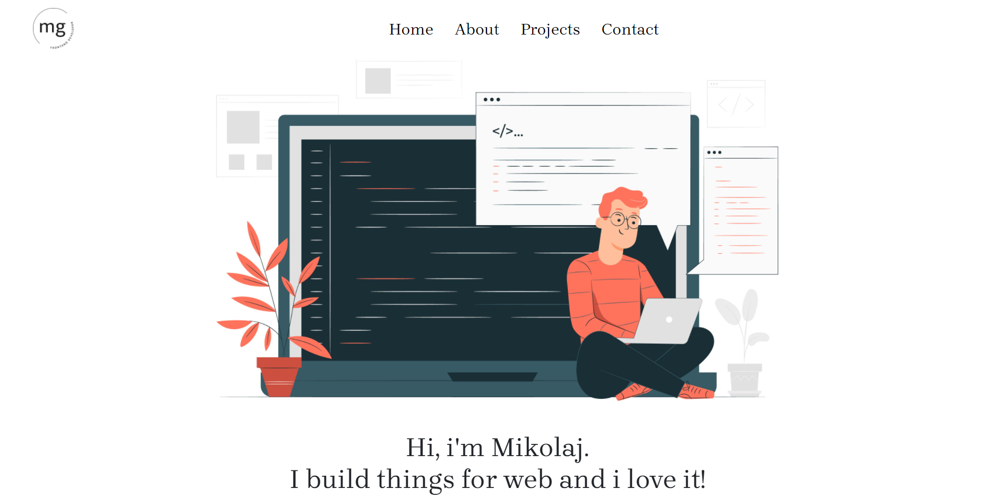

# Portfolio Site 🔥🔥

Portfolio site made to showcase project i'm working on.  
Site was build using OOP.

## How to run the app

1. Either fork or download the app and open the folder in the cli.
2. Install all dependencies using the `npm install` command.
3. Start the web server using the `npm run start:dev` command. The app will be served at http://localhost:9000/
8. Go to http://localhost:9000/ in your browser and check the website.

## Technologies used

- JavaScript
- Sass
- Webpack
- AOS animations
- Axios

## How does the App looks like?

